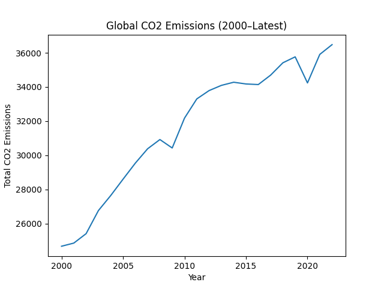
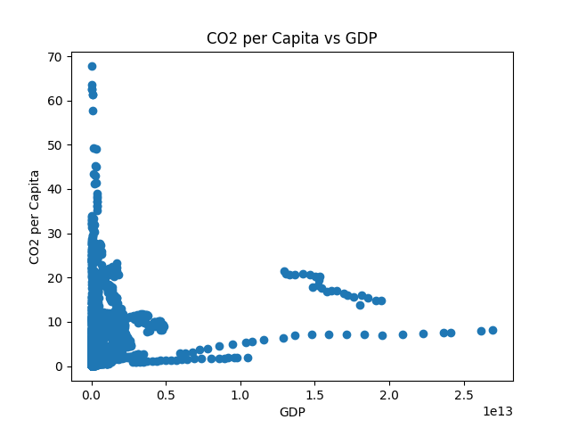

# 🌍 Global Carbon Emissions vs GDP (2000–Latest)

## 📌 Project Overview
This project analyzes the relationship between economic growth and carbon emissions using global ESG data.

Using Python and real-world data, the analysis explores:
- Global CO2 emission trends since 2000
- The relationship between GDP and CO2 per capita
- Top emitting countries
- Carbon intensity across economies

## 📊 Data Source
Our World in Data – CO2 and Greenhouse Gas Emissions Dataset

## 🛠 Tools Used
- Python
- Pandas
- Matplotlib
- Google Colab

## 🔎 Key Insights
- Global CO2 emissions have increased significantly since 2000.
- Higher GDP countries tend to show higher per capita emissions.
- Carbon intensity differs significantly across countries, highlighting efficiency gaps.

## 📈 Why This Matters
Understanding the economic-carbon relationship is central to ESG analysis, climate policy, and sustainable finance decision-making.

## 📊 Sample Visualizations

